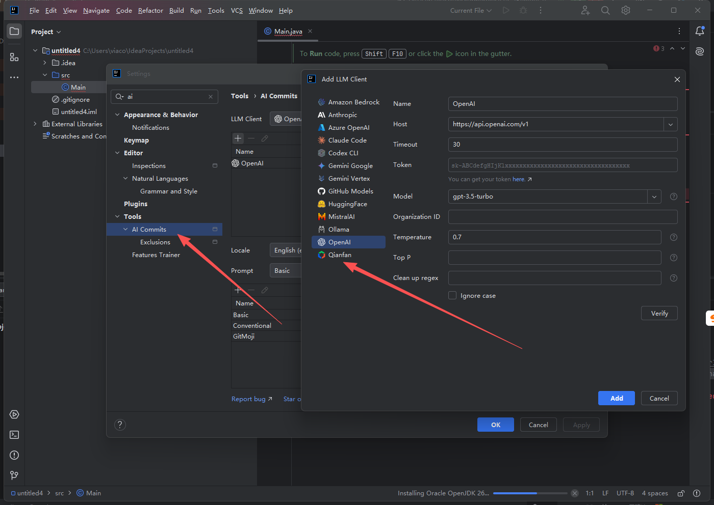
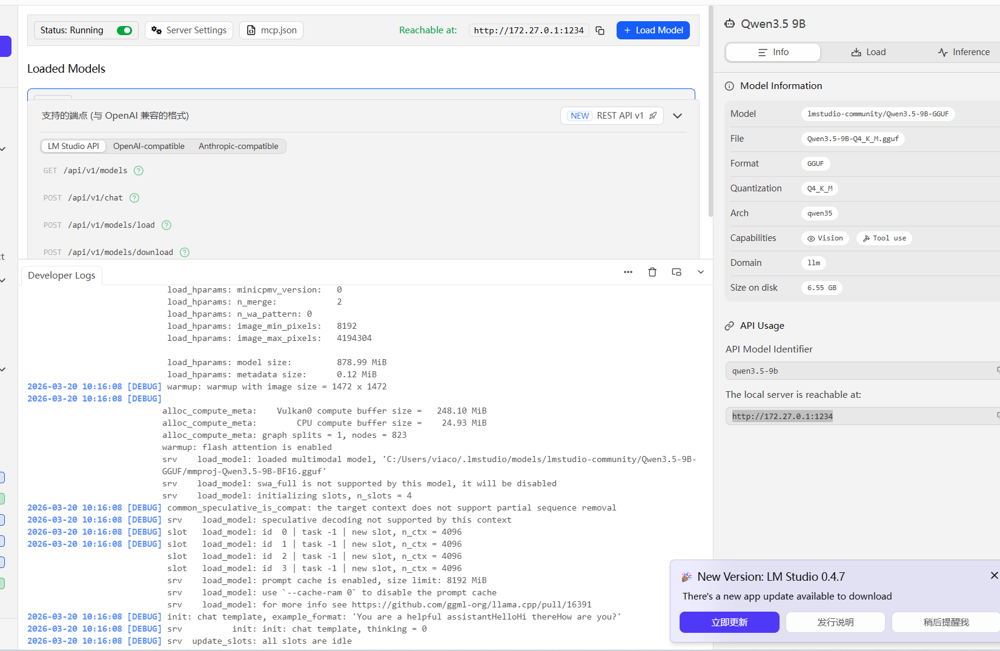
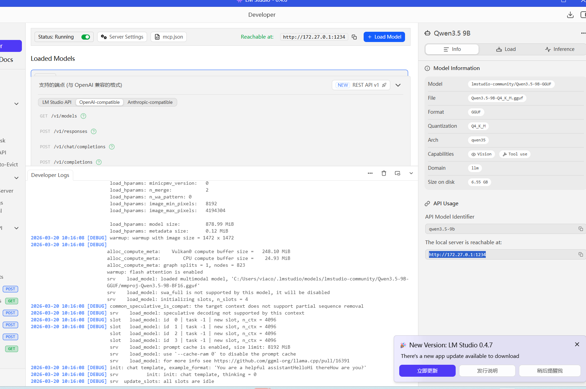
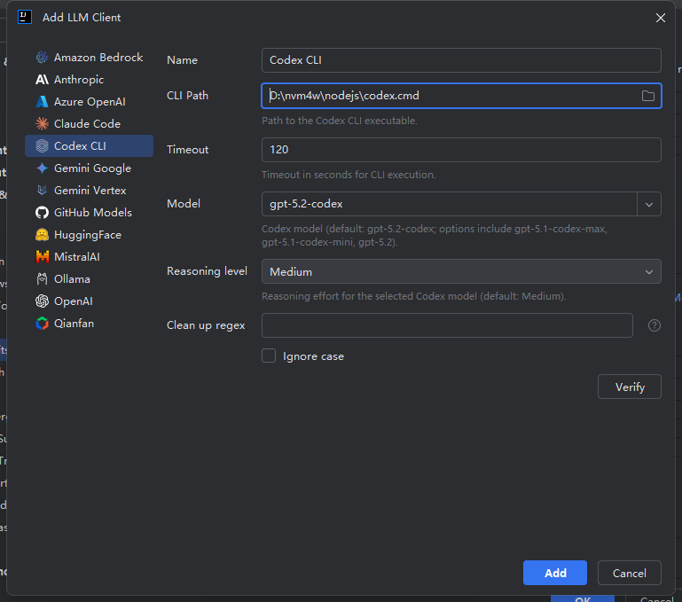
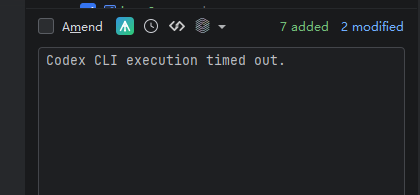

1.名称改为：Ai Commits Plus

2.增加deepseek 的支持

3.增加本地lm studio 的支持
默认模型是:qwen3.5-9b
host:http://127.0.0.1:1234

4.openai 增加对本地或者第三方的支持，特别是http 的支持

http://127.0.0.1:1234/v1

5.修复codex cli 出错的问题
命令已经获取了 地址
C:\Users\viaco>where codex
D:\nvm4w\nodejs\codex
D:\nvm4w\nodejs\codex.cmd

填入后无法正常生成git commit

6.方便测试 
增加右键项目 test Ai Commits Plus 的按钮。可以越过git 配置 直接测试 插件效果。
